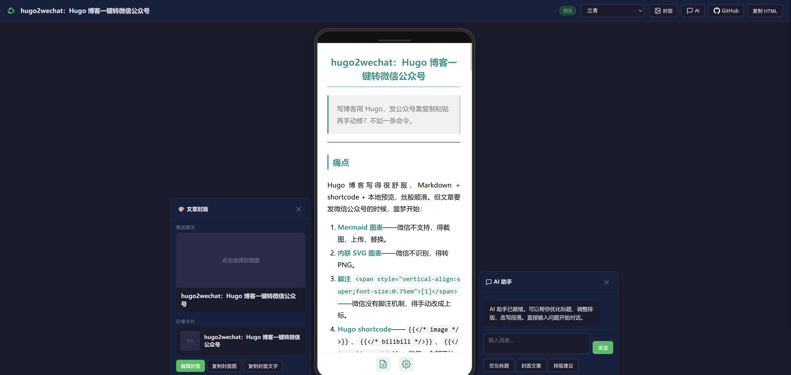

> 写博客用 Hugo，发公众号靠复制粘贴再手动修？不如一条命令。

---

## 痛点

Hugo 博客写得很舒服，Markdown + shortcode + 本地预览，丝般顺滑。但文章要发微信公众号的时候，噩梦开始：

1. **Mermaid 图表**——微信不支持，得截图、上传、替换。
2. **内联 SVG 图表**——微信不识别，得转 PNG。
3. **脚注 `[^1]`**——微信没有脚注机制，得手动改成上标。
4. **Hugo shortcode**——``、``、``，微信一个都不认识。
5. **相对链接**——`/posts/xxx/` 在微信里统统 404，得补全域名。
6. **代码高亮**——Hugo 的高亮样式带不到微信编辑器里。
7. **文末署名**——每次手动加 '— whitefirer'。

每篇都做一遍，烦。而且第 3 次到第 30 次没有本质区别——重复劳动，纯消耗。

需要一个工具：**把 Hugo 源文件扔进去，输出微信编辑器能直接粘贴的 HTML**。

---

## 方案

hugo2wechat 就是干这个的。一条管道：

```
Hugo .md
  ↓ 剥 frontmatter
  ↓ mermaid → PNG (mmdc + Chromium)
  ↓ asciinema → GIF (agg)
  ↓ Hugo shortcode 清理
  ↓ 系列导航删除
  ↓ 相对链接补全
  ↓ 内联 SVG → PNG (resvg)
  ↓ 外部 SVG → PNG (Chromium + Pillow)
  ↓
干净 Markdown
  ↓ markdown2wechat API 排版（内联样式 + 代码高亮）
  ↓
微信公众号兼容 HTML
```

核心思路两段式：**预处理管道**把 Hugo 专有元素翻译成通用 Markdown，**排版引擎**把 Markdown 转成微信兼容的内联样式 HTML。

---

## 管道详解

### 第一阶段：clean_hugo —— 剥壳

Hugo Markdown 和标准 Markdown 之间隔了一层 shortcode 生态。第一阶段的任务就是**去 Hugo 化**。

**Mermaid → PNG**

Mermaid 代码块微信无法渲染。解法：用 `mmdc`（mermaid-cli）+ Chromium 无头浏览器渲染成 PNG，base64 内嵌。管线逐个处理，带进度输出：

```
Mermaid 1/3 (graph TD...) ✓ 2.3s
Mermaid 2/3 (sequenceDiagram...) ✓ 1.8s
Mermaid 3/3 (gantt...) ✓ 2.1s
```

**Asciinema → GIF**

终端录屏 `.cast` 文件用 `agg` 转成 GIF（并行，最多 2 worker）。`--fps-cap 15` 控制体积，降级方案 `asciicast2gif`。

**图片短代码**

`` → 标准 `` 或 `<figure>` 标签，相对路径补全为绝对 URL。

**Bilibili 短代码**

`` → `> 原片可在 B站搜索「BV1xx411c7mD」观看。`

**脚注**

`[^1]: 参考文献文字` 收集为文末参考资料表格，正文 `[^1]` 替换为上标 `<span style="vertical-align:super;font-size:0.75em">[1]</span>`。完全兼容微信编辑器。

**系列导航 & 杂项清理**

`<div class="post-series-nav">` 导航块删除，``、`` 等短代码剥离标签保留内容。相对链接 `/posts/x/` 补全为 `https://whitefirer.org/posts/x/`。

### 第二阶段：SVG 转换

微信对 SVG 支持很差。管线分两路处理：

| SVG 类型 | 工具 | 方式 |
|----------|------|------|
| 内联 `<svg>` | resvg | 2.5x 缩放 → PNG base64 |
| 外部 `./file.svg` | Chromium + Pillow | 无头截图 → 自动裁边 → PNG |

resvg 处理内联 SVG 极快（毫秒级），不需要浏览器。外部 SVG 走 Chromium 截图后用 Pillow 做白边裁剪——对比背景色计算 bounding box，精准去掉多余留白。

### 第三阶段：排版引擎

处理干净的 Markdown 交给 [markdown2wechat](https://github.com/markdown2wechat/markdown2wechat)（Next.js 服务，端口 3456）。这个引擎负责：

- Markdown → HTML（内联样式，微信兼容）
- 代码高亮（highlight.js Atom One Dark 主题）
- 主题切换（支持多种微信排版主题）

为什么拆成独立服务？排版引擎的逻辑和预处理管道正交——预处理关心 Hugo 特有元素，排版关心 Markdown 到 HTML 的通用转换。拆开各自独立迭代。

### 第四阶段：后处理

markdown2wechat 输出后做最后一道清洗：

- **mdnice 残留属性**——`data-website="https://www.mdnice.com"`、`data-tool="mdnice"` 等清理
- **空 div**——`<div></div>` 删除
- **文末署名**——追加 `— whitefirer`

---

## 预览服务器

命令行 `convert.py` 适合最终导出，但写作过程中需要反复预览。`preview.py` 是 FastAPI 开发的预览服务器，提供：



**实时渲染（SSE 推送进度）**

```
预处理... ✓ 2.1s
SVG→PNG... ✓ 0.3s
排版...   ✓ 1.5s
```

每步进度通过 Server-Sent Events 实时推送到浏览器，不用干等。

**展示 / 复制双视图**

左侧是**带标题的展示视图**（含 `# 标题`，预览效果），右侧是**纯正文复制视图**（不含标题，内嵌 base64 图片）。复制视图的代码块右上角有复制按钮，一键拿到微信编辑器直接粘贴的内容。

**主题切换**

markdown2wechat 支持多套微信排版主题，预览页可实时切换查看效果。

**AI 辅助**

内建 AI 侧边栏（支持 DeepSeek / OpenAI / Anthropic），可对文章内容提问、改写段落、优化标题——上下文自动注入当前文章内容。

**封面编辑器**

提取文中所有图片供选择封面，AI 生成宣传文案，DALL-E 生成封面图。

**Markdown 编辑器（开发模式）**

与 Hugo 开发模式联动：网页抽屉编辑器通过 `/raw`、`/save`、`/edit` 接口直接读写 Hugo 源文件，token 鉴权。

---

## 用法

### 安装

```bash
git clone https://github.com/whitefirer/hugo2wechat.git
cd hugo2wechat
bash setup.sh
```

setup.sh 自动安装：系统依赖（resvg、Chromium）、Python 依赖（FastAPI、Pillow 等）、Node 依赖（mmdc）。

### 本地预览

```bash
# 终端快速转换
python3 convert.py content/posts/my-article/index.md

# 启动预览服务器
python3 preview.py --content-dir ../mysite/content/posts
# 打开 http://localhost:3333
```

### API 渲染（正式导出）

先启动 markdown2wechat：

```bash
cd markdown2wechat/next && npx next dev -p 3456
```

再运行转换：

```bash
python3 convert.py post.md --api --theme orangeheart
```

### 批量转换

```bash
python3 convert.py -c wechat.yml
```

配置文件示例（YAML）：

```yaml
api_url: "http://localhost:3456/api/convert"
api: true
author: "whitefirer"
output_dir: "/tmp/wechat-output"

posts:
  - source: "content/posts/article-1/index.md"
  - source: "content/posts/article-2/index.md"
  - source: "https://blog.example.com/posts/article-3/"
```

---

## 转换清单总览

| Hugo 元素 | 处理 | 工具 |
|-----------|------|------|
| Frontmatter | 剥离，title → 标题 | Python |
| `` | 渲染为 PNG | mmdc + Chromium |
| `` | 转为 GIF（并行） | agg |
| `` | 提取 src → markdown 图片 | regex |
| `` | B站搜索提示 | regex |
| 内联 `<svg>` | 渲染为 PNG（2.5x） | resvg |
| 外部 `./file.svg` | 截图 + 裁边 → PNG | Chromium + Pillow |
| `[^1]` 脚注 | 上标 + 文末表格 | regex |
| 系列导航 | 删除 | regex |
| 相对链接 `/posts/x/` | 补全 base_url | regex |
| 代码高亮 | 内联样式 | highlight.js |
| mdnice 残留属性 | 清理 | regex |
| 文末署名 | 追加 `— author` | Python |

---

## 设计取舍

**为什么不直接用 mdnice / markdown-nice？**

mdnice 解决的是"Markdown → 微信排版"的通用问题。hugo2wechat 解决的是"Hugo Markdown → 微信排版"的特定问题。差异在于 Hugo 生态的 shortcode、Mermaid 图表、SVG 插图——这些 mdnice 不认识，但 hugo2wechat 认识，因为它是为 Hugo 工作流定制的。

**为什么拆成 convert.py + preview.py？**

convert.py 是无状态的命令行工具，适合 CI / 批处理。preview.py 是有状态的 Web 服务，适合交互式写作。共用 clean_hugo 和 svg_to_img 核心函数，各自封装不同的 UI 层。

**为什么预览要 SSE 推送进度？**

Mermaid 渲染一个复杂图表可能 2-3 秒，Asciinema 转 GIF 可能更久。用户需要知道管线在做什么，而不是盯着空白页面猜。

---

## 技术栈

| 层 | 技术 |
|---|------|
| 预处理管道 | Python 3，正则，subprocess |
| 预览服务器 | FastAPI + Jinja2 + SSE |
| 排版引擎 | markdown2wechat（Next.js） |
| SVG 渲染 | resvg（内联）、Chromium headless（外部） |
| 图表渲染 | mmdc + Puppeteer / Chromium |
| 终端录屏 | agg（主）、asciicast2gif（备） |
| 图片后处理 | Pillow |
| AI 辅助 | OpenAI / DeepSeek / Anthropic API |

所有依赖一键安装（`bash setup.sh`），仅 Chromium 和 resvg 需系统包管理器。

---

## 总结

hugo2wechat 做的事情很窄：把 Hugo 博客文章转成微信公众号能用的 HTML。但这正是一个好工具该有的样子——**把一类重复劳动降到零**。

Hugo 写完文章，跑一条命令，打开预览服务器看一眼，复制粘贴到微信编辑器，发布。中间没有手动截图、手动改链接、手动调格式。

代码开源在 [GitHub: whitefirer/hugo2wechat](https://github.com/whitefirer/hugo2wechat)，MIT 协议。
